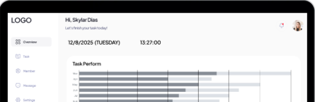
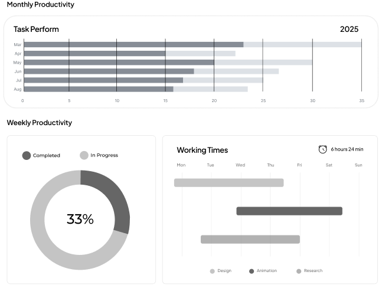

1. PREVIOUS VERSION HOMEPAGE

<!DOCTYPE html>
<html lang="en">
<head>
  <meta charset="UTF-8">
  <meta name="viewport" content="width=device-width, initial-scale=1.0">
  <title>homepage</title>
  <link rel="stylesheet" href="/RWDD-Assignment/Front-end/CSS/style.css">
</head>
<body>
  

    <!-- Header -->
    <header>
      
      
      <!-- Hamburger Menu -->
      

        
        
        
      

      

        <a href="#home">Home</a>
        <a href="#about">About</a>
        <a href="#objective">Objective</a>
        <a href="#product">Product</a>
        <a href="#support">Support</a>
      

    </header>

    <!-- Hero Section -->
    <nav id="home">
      

        <h1>
          “Task
          Flow”
        </h1>
        
Task Management Website

      

      

        <a href="signup.html" class="btn">Get Start</a>
      

      
    </nav>

    <!-- About Section -->
    <section id="about" class="about_section">
      
About

      
Lorem ipsum dolor sit amet consectetur adipisicing elit. Id ducimus culpa voluptate, voluptatum dicta delectus provident officiis beatae minus similique hic, inventore numquam quos iste sequi aperiam quidem quibusdam! Numquam.

    </section>

    <!-- Objective Section -->
    <section id="objective" class="objective_section">
      <h1 class="objective">Objective</h1>
      <ul class="objective_details">
        <li>To provide a user-friendly interface for task management.</li>
        <li>To enhance productivity through effective task organization.</li>
        <li>To facilitate collaboration among team members.</li>
        <li>To offer real-time updates and notifications.</li>
      </ul>
    </section>

    <!-- Product Section -->
    <section id="product" class="product_section">
      <h1>Product</h1>

      

        
        
Lorem ipsum dolor sit amet consectetur adipisicing elit. Id ducimus culpa voluptate...

      

      

        
        
Lorem ipsum dolor sit amet consectetur adipisicing elit. Id ducimus culpa voluptate...

      

      

        
        
Lorem ipsum dolor sit amet consectetur adipisicing elit. Id ducimus culpa voluptate...

      

      

        
        
Lorem ipsum dolor sit amet consectetur adipisicing elit. Id ducimus culpa voluptate...

      

    </section>

    <!-- Support Section -->
    <section id="support" class="support_section">
      <h1>Support</h1>
      

        
        
Lorem ipsum dolor sit amet, consectetur adipisicing elit. A repellendus modi totam vitae nulla illum unde repudiandae?

      

    </section>

    

    <!-- Footer -->
    <footer class="footer">
      

        

          
        

        <nav class="footer_nav">
          
About

          <ul>
            <li><a href="#home">Home</a></li>
            <li><a href="#about">About</a></li>
            <li><a href="#objective">Objective</a></li>
            <li><a href="#product">Product</a></li>
            <li><a href="#support">Support</a></li>
          </ul>
        </nav>
      

      

      

        
©2025 TaskFlow

        

          
Privacy & Policy &emsp; Terms & Condition

        

      

    </footer>
  

  <!-- JS for hamburger menu -->
  
</body>
</html>