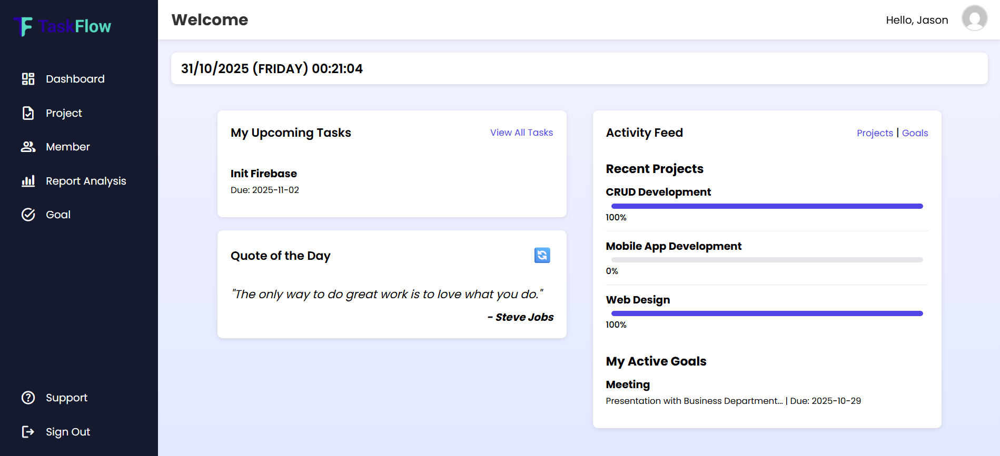
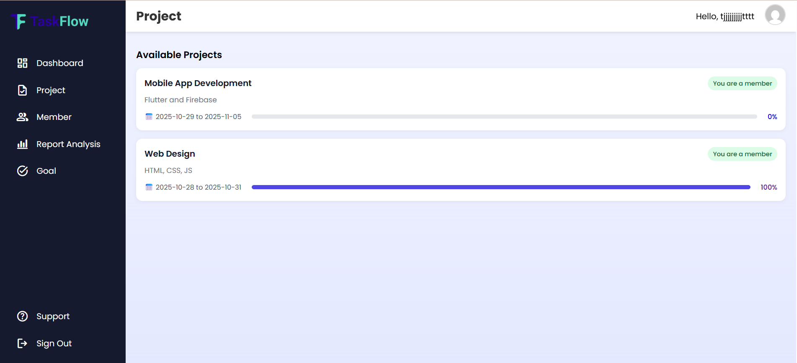
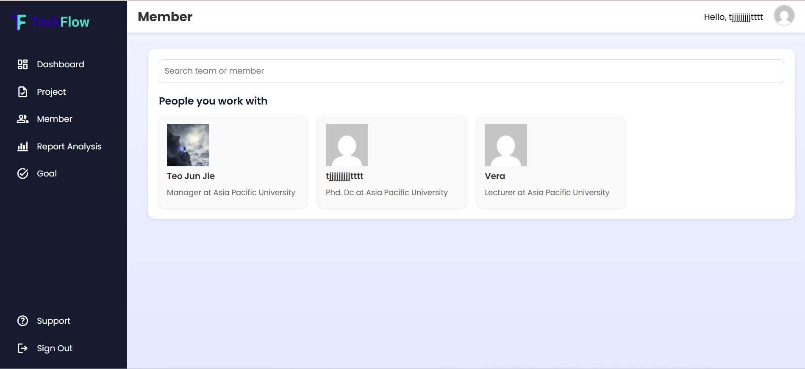
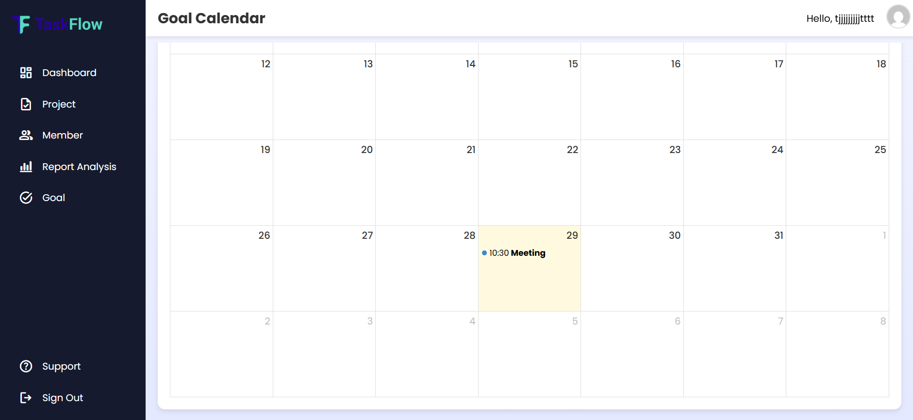
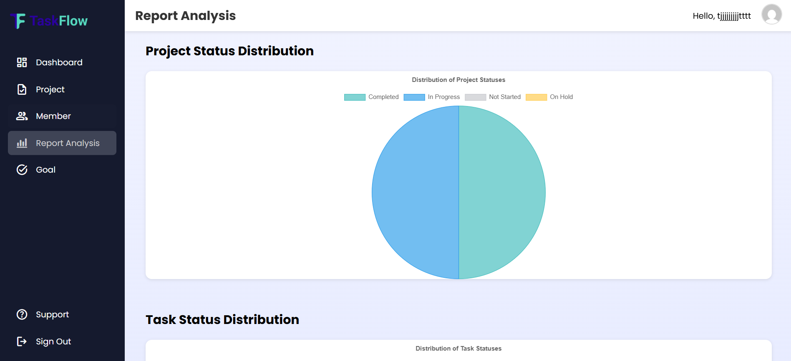

# TaskFlow - Project Management & Collaboration Platform

<p align="center">
  
</p>

<p align="center">
  <strong>Streamline workflows, track progress, and achieve more with an all-in-one platform designed for individuals and teams.</strong>
</p>

<p align="center">
  
  
  
  
  
</p>

---

## 📋 Table of Contents

- [✨ Key Features](#-key-features)
- [📂 Project Structure](#-project-structure)
- [🗄️ Database Schema](#️-database-schema)
- [🛠️ Technology Stack](#️-technology-stack)
- [📸 Screenshots](#-screenshots)
- [🚀 Getting Started](#-getting-started)
- [🌐 Live Demo](#-live-demo)
- [📄 License](#-license)

---

## ✨ Key Features

-   👤 **Role-Based Access Control:** Differentiated experience for **Admins** (Managers) and **Users** (Employees).
-   🗂️ **Project Management:**
    -   Admins can create, update, and delete projects.
    -   Users can view and join projects.
    -   Track project progress with percentage-based completion bars.
-   ✔️ **Task Management:**
    -   Assign tasks to specific project members.
    -   Track task status (Open, Done).
    -   Upload and download files associated with tasks.
-   🎯 **Goal Setting:** Personal goal tracking with a dedicated list and calendar view.
-   🤝 **Team Collaboration:** View a directory of all members and their roles.
-   📊 **Reporting & Analysis:** Visualize project and task status distribution with interactive charts.
-   🔒 **Secure Authentication:** Robust login, registration, and password reset functionality with Google reCAPTCHA protection.
-   📱 **Responsive Design:** A seamless experience across desktop, tablet, and mobile devices.

---

## 📂 Project Structure

The project is organized within the `Front-end/` directory, with a clear separation of concerns:

```
/Front-end
|-- /Config/        # All backend PHP scripts for database operations and logic.
|-- /CSS/           # All CSS stylesheets for different pages.
|-- /JS/            # All client-side JavaScript files.
|-- /Pictures/      # Image assets used across the application.
|-- /uploads/       # Directory for user-uploaded files.
|-- *.php           # The main PHP files for each page.
```

---

## 🗄️ Database Schema

The application relies on a MySQL database named `rwdd`. The main tables are:

-   **`users`**: Stores user information, credentials, and roles.
    -   `user_ID` (Primary Key)
    -   `username`, `email`, `password`
    -   `company`, `position`
    -   `Role_ID` (e.g., 1 for User, 2 for Admin)

-   **`projects`**: Contains all project details.
    -   `Project_ID` (Primary Key)
    -   `Title`, `Description`
    -   `Project_Start_Date`, `Project_End_Date`
    -   `Project_Status`, `Progress_Percent`

-   **`project_members`**: Links users to projects (many-to-many relationship).
    -   `Project_ID` (Foreign Key to `projects`)
    -   `User_ID` (Foreign Key to `users`)

-   **`tasks`**: Stores tasks related to projects.
    -   `Task_ID` (Primary Key)
    -   `Title`, `Description`, `Status`
    -   `Project_ID` (Foreign Key to `projects`)
    -   `User_ID` (The user the task is assigned to)

-   **`goals`**: Stores personal user goals.
    -   `Goal_ID` (Primary Key)
    -   `Title`, `Description`, `Status`
    -   `Goal_Start_Time`, `Goal_End_Time`
    -   `User_ID` (Foreign Key to `users`)

-   **`files`**: Manages file uploads associated with tasks.
    -   `File_ID` (Primary Key)
    -   `File_Name`, `File_URL`
    -   `Task_ID` (Foreign Key to `tasks`)

---

## 🛠️ Technology Stack

-   **Backend:** PHP
-   **Frontend:** HTML, CSS, JavaScript
-   **Database:** MySQL
-   **JavaScript Libraries:**
    -   [Chart.js](https://www.chartjs.org/) for data visualization.
    -   [FullCalendar](https://fullcalendar.io/) for goal scheduling.
    -   [Particles.js](https://vincentgarreau.com/particles.js/) for homepage animations.

---

## 📸 Screenshots

Here's a glimpse into the TaskFlow platform, showcasing its clean interface and powerful features.

| Dashboard | Project Page | Member Management |
| :---: | :---: | :---: |
|  |  |  |

| Goal Calendar | Report Analysis |
| :---: | :---: |
|  |  |

---

## 🚀 Getting Started

Follow these instructions to get a copy of the project up and running on your local machine.

### Prerequisites

-   A local server environment like [XAMPP](https://www.apachefriends.org/index.html) or WAMP.
-   PHP & MySQL (included with XAMPP).

### Installation

1.  **Clone the repository:**
    ```sh
    git clone https://github.com/your-username/RWDD-Assignment.git
    ```

2.  **Move to your web server directory:**
    -   Place the cloned `RWDD-Assignment` folder into the `htdocs` directory of your XAMPP installation (e.g., `C:\xampp\htdocs\`).

3.  **Database Setup:**
    -   Open phpMyAdmin (usually at `http://localhost/phpmyadmin`).
    -   Create a new database named `rwdd`.
    -   **Important:** You need to manually create the tables based on the schema described above.

4.  **Configuration:**
    -   Verify that the database credentials in `Front-end/Config/db_connect.php` match your local setup (default is user `root` with no password).
    -   **Crucial:** You must add your own Google reCAPTCHA v2 site and secret keys for the login/signup to work.
        -   Secret Key in: `Front-end/Config/login.php` & `Front-end/Config/signup.php`
        -   Site Key in: `Front-end/signup.php`

### Running the Application

1.  Start the **Apache** and **MySQL** services from your XAMPP Control Panel.
2.  Open your web browser and navigate to the project's `Front-end` directory. The URL will be similar to this:
    ```
    http://localhost/RWDD-Assignment/Front-end/
    ```

---

## 🌐 Live Demo

*(Coming Soon! A link to a live, deployed version of this project would go here.)*

---

## 📄 License

This project is licensed under the MIT License - see the [LICENSE.md](LICENSE.md) file for details. *(You would need to create a LICENSE.md file for this link to work).*
