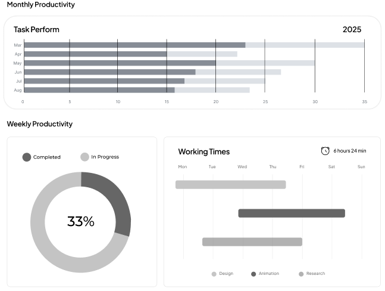
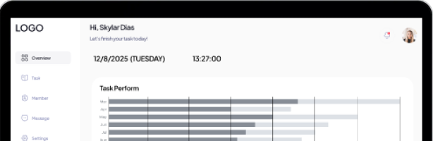

# TaskFlow - Project Management & Collaboration Platform

<p align="center">
  
</p>

<p align="center">
  <strong>Streamline workflows, track progress, and achieve more with an all-in-one platform designed for individuals and teams.</strong>
</p>

---

## ✨ Key Features

-   **Role-Based Access Control:** Differentiated experience for **Admins** (Managers) and **Users** (Employees).
-   **Project Management:**
    -   Admins can create, update, and delete projects.
    -   Users can view and join projects.
    -   Track project progress with percentage-based completion bars.
-   **Task Management:**
    -   Assign tasks to specific project members.
    -   Track task status (Open, Done).
    -   Upload and download files associated with tasks.
-   **Goal Setting:** Personal goal tracking with a dedicated list and calendar view.
-   **Team Collaboration:** View a directory of all members and their roles.
-   **Reporting & Analysis:** Visualize project and task status distribution with interactive charts.
-   **Secure Authentication:** Robust login, registration, and password reset functionality with Google reCAPTCHA protection.
-   **Responsive Design:** A seamless experience across desktop, tablet, and mobile devices.

## 📸 Screenshots

*A great way to show off your project is with screenshots! You can replace these placeholder images with your own.*

| Dashboard | Project View |
| :---: | :---: |
|  |  |

## 🛠️ Technology Stack

-   **Backend:** PHP
-   **Frontend:** HTML, CSS, JavaScript
-   **Database:** MySQL
-   **JavaScript Libraries:**
    -   [Chart.js](https://www.chartjs.org/) for data visualization.
    -   [FullCalendar](https://fullcalendar.io/) for goal scheduling.
    -   [Particles.js](https://vincentgarreau.com/particles.js/) for homepage animations.

## 🚀 Getting Started

Follow these instructions to get a copy of the project up and running on your local machine for development and testing purposes.

### Prerequisites

-   A local server environment like [XAMPP](https://www.apachefriends.org/index.html) or WAMP.
-   PHP (included with XAMPP)
-   MySQL (included with XAMPP)

### Installation

1.  **Clone the repository:**
    ```sh
    git clone https://github.com/your-username/RWDD-Assignment.git
    ```
2.  **Move to your web server directory:**
    -   Place the cloned `RWDD-Assignment` folder into the `htdocs` directory of your XAMPP installation (e.g., `C:\xampp\htdocs\`).

3.  **Database Setup:**
    -   Open phpMyAdmin (usually at `http://localhost/phpmyadmin`).
    -   Create a new database named `rwdd`.
    -   You will need to manually create the tables. You can find the schema in `Front-end/specification.md`.
    -   *Suggestion: For easier setup, you could create a `database.sql` file with the table creation queries and add it to the repository. Then, users could simply import this file into the `rwdd` database.*

4.  **Configuration:**
    -   Verify that the database credentials in `Front-end/Config/db_connect.php` match your local setup (the default is user `root` with no password).
    -   **Important:** You must add your own Google reCAPTCHA v2 secret key in the following files for the login/signup to work:
        -   `Front-end/Config/login.php`
        -   `Front-end/Config/signup.php`

### Running the Application

1.  Start the Apache and MySQL services from your XAMPP Control Panel.
2.  Open your web browser and navigate to the project's `Front-end` directory. The URL will be similar to this:
    ```
    http://localhost/RWDD-Assignment/Front-end/
    ```
    *(Note: The path may vary depending on your folder structure within `htdocs`)*
